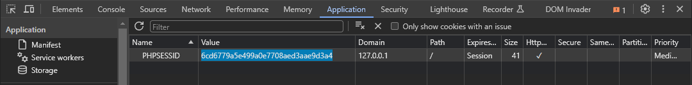

# CVE-2024-41958-PoC

This is a small proof of concept for `CVE-2024-41958`.

It is possible to bypass the TFA authentication on the admin panel.

Affected versions: `< 2024-07`

### Prerequisites needed for the CVE to function:

- `Password` and `username` for an account without TFA.
- `Password` and `username` for an account which has TFA enabled.
- Mailcow version below `2024-07`.

### How to use the poc:

1. Install the dependency

```
pip install -r requirements.txt
```

2. Fill in the necessary informations in the sript

- URL
- Password and username for the user who does not have TFA enabled
- Password and username for the user who has TFA enabled

3. Run the script

```
python poc.py
```

The output if the script works fine:
```
PoC works!

PHPSESSID=6cd6779a5e499a0e7708aed3aae9d3a4
```

4. Copy the `PHPSESSID` and set the cookie in your browser



5. Refresh the page

6. You are now logged in as the user with TFA enabled


Author: `Patrik Mayor`